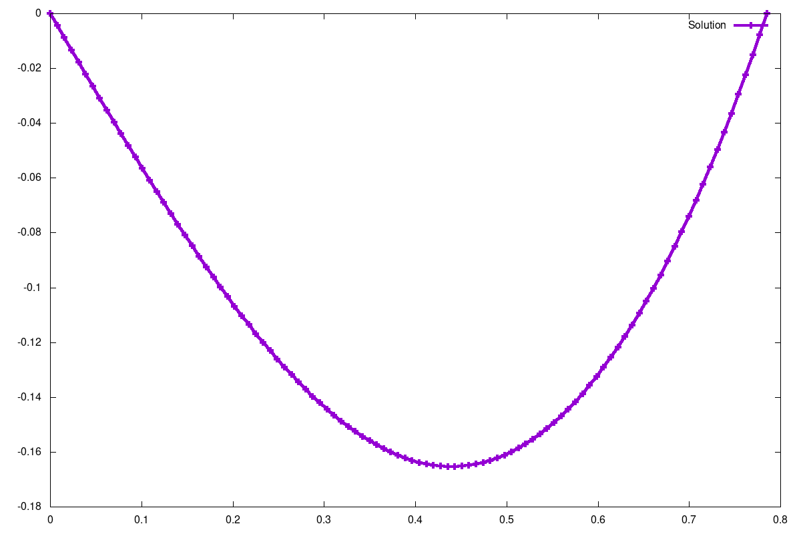
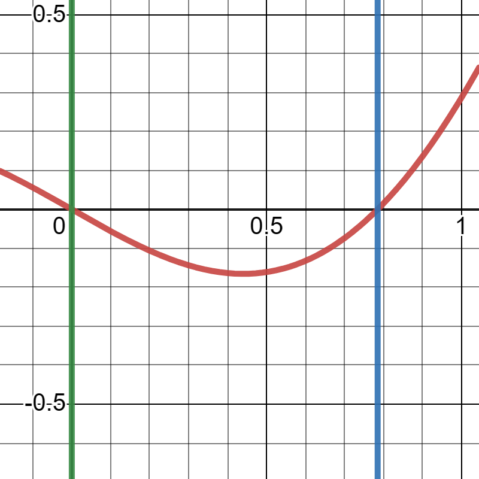

### Task

Find a numerical vector solution of system of `m` equations $F(x)=0,\ x=(x^1,...,x^m)^T$ with an accuracy of `eps` using Newton's method.

#### Build
```bash
$ make
```

#### Solve system of equations (Newton.pdf 2)
See help
```bash
$ ./Newton.out
```
To solve system of 3 equations

$$\begin{cases}
  x^2+y^2+z^2=10 \\
  -x^2+(y-3)^2=z \\
  x+2-\frac{y}{3}+z=0
\end{cases}$$

witn precision of $1e-10$ and with initital approximation $(0, 0.5, 1)$ use:
```bash
$ ./Newton 1e-10 3
   -3.01007258012015
   -0.16475754761303
    0.95515339758247
```
To solve next system of equations with initial approximation $(0.5,0.5)$ instead

$$\begin{cases}
  x^{2}-y^{2}=1 \\
  x^{2}+y^{2}=15
\end{cases}$$

modify `SystemOfEquations.c` in the following way:
```c
void InitialApproximation(double *x, unsigned m) {
  (void)m;
  x[0] = 0.5;
  x[1] = 0.5;
}

void F(double *f, const double *x, unsigned m) {
  (void)m;
  f[0] = pow(x[0], 2) - pow(x[1], 2) - 1;
  f[1] = pow(x[0], 2) + pow(x[1], 2) - 15;
}

void dF(double *jacobian, const double *x, unsigned m) {
  (void)m;
  J(0, 0) = 2. * x[0];
  J(0, 1) = -2. * x[1];
  J(1, 0) = 2. * x[0];
  J(1, 1) = 2. * x[1];
}
```
Then rebuild and run:
```bash
$ make
$ ./Newton.out 1e-10 2
    2.82842712474619
    2.64575131106459
```

#### Solve second-order differential equation (Newton.pdf 2a)

See help
```bash
$ ./DiffEquation.out -h
```
To solve differential equation using Newton's method

$$\begin{cases}
y''=\cos(x)\sin(y),\  x\in(0, 10)\\
y(0)=-1 \\
y(10)=1
\end{cases}$$

with precision $1e-10$ and with $100$ algebraic equations and save solution to `data/sincos_solution.txt` use
```bash
$ ./DiffEquation.out -m 100 -a -1 -b 1 -X 10 -e 1e-10 > data/sincos_solution.txt
```
To plot solution to `data/sincos.png` use
```bash
$ gnuplot -c solution.gnuplot data/sincos_solution.txt data/sincos.png
```


To solve next differentional equation instead

$$\begin{cases}
y''=4x - 4y,\  x\in\left(0, \frac{\pi}{4}\right)\\
y(0)=0 \\
y\left(\frac{\pi}{4}\right)=0
\end{cases}$$

modify `DiffEquation.c` in the following way
```c
static double RightPart(double x, double y) { return 4. * x - 4. * y; }

static double RightPartDerivativeByY(double x, double y) { (void)x; (void)y; return -4.; }
```
with precision $1e-14$ and with $50$ algebraic equations and save solution to `data/exact_solution.txt` use
```bash
$ ./DiffEquation.out -m 50 -a 0 -b 0 -X 0.7853981633974483 -e 1e-14 > data/exact_solution.txt
```
To plot solution to `data/exact.png` use
```bash
$ gnuplot -c solution.gnuplot data/exact_solution.txt data/exact.png
```


This differential equation has analytical solution

$$y(x)=x-\frac{\pi}{4}\sin(2x)$$


