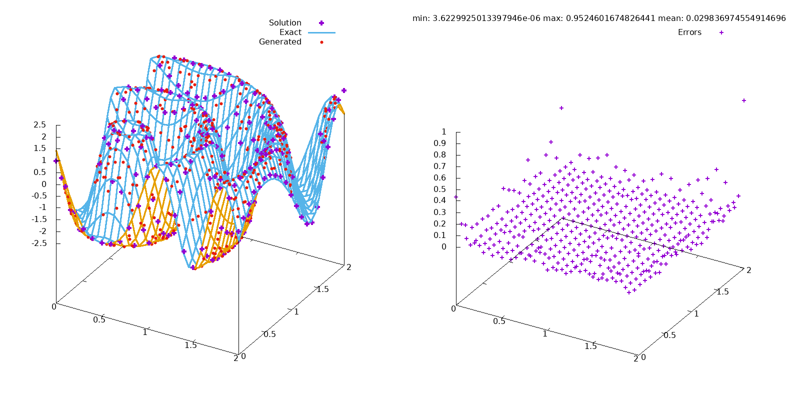

### Models of Spatial Variables

#### Build
```bash
$ make
```

#### Generate points
See help
```bash
$ ./Generate.out
```
To generate 1000 points on a rectange $[0, 2]\times[0, 2]$ using function from `ExactSolution.c` and save the result to `data/input.txt` use
```bash
$ ./Generate.out 1000 2 2 > data/input.txt
```

#### Radial Basis Function
See help
```bash
$ ./RBFInterpolator.out
```
Using `data/input.txt` calculate values on a rectangle $[0, 2]\times[0, 2]$ with
the grid which consists 200 vertical and 20 horizontal lines and save to `data/output.txt`
```bash
$ ./RBFInterpolator.out 2 2 20 20 < data/input.txt > data/output.txt
```
To plot solution into `data/solution.png` of a known function $2\sin(10\sqrt{(x-0.5)^2+(y-0.5)^2})$ use gnuplot notation of a function in the next command:
```bash
$ ./print_solution.sh data/output.txt "2*sin(10*sqrt((x-0.5)**2+(y-0.5)**2))" data/solution.png
```


